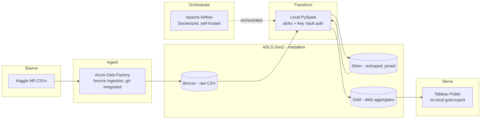

# M5 demand forecasting - Azure data engineering pipeline

Hierarchical demand forecasting groundwork on Walmart's real M5 dataset (30,490 item-store series, 1,941 days of daily sales), built as a working ingest-to-gold pipeline on Azure. The transform layer ended up running locally after three separate Azure subscription-tier walls ruled out the cloud compute options one by one.

Full build log, the original architecture plan, and every decision (including the parts that didn't work) live in [`docs/project_spec.md`](docs/project_spec.md). This file covers what's actually running and how to run it yourself.

## What this actually is

I set out to build a full lakehouse pipeline across most of the modern Azure data stack: ADF, Databricks, Synapse, Fabric, dbt, Purview, Azure ML, Power BI. Three of those hit real, non-negotiable limits on an Azure for Students subscription: a subscription-wide compute quota (Databricks), an account-type gate on Fabric that has nothing to do with quota, and a fraud-prevention block on provisioning new Azure SQL servers, which killed Synapse's serverless SQL pool even though serverless is supposed to need no provisioned compute at all. Each one is documented in detail in the spec, because working around a real constraint and saying so is a better engineering story than a build with no friction in it.

What actually ships in v1: ADF handles ingestion, Airflow orchestrates, local PySpark does the transform work against the same ADLS Gen2 lake a cloud engine would have used, and Tableau Public serves the result. dbt, Purview, and the actual forecasting model (the point of a project called "demand forecasting") are explicit next steps, not abandoned ideas -- see the spec's final section for the honest state of each.

## Architecture (what's running today)

## What's in the repo

| Path | Contents | Status |
|---|---|---|
| `infra/` | Terraform: resource group, provider config | Partial -- storage account and Key Vault were built via the Portal on purpose, see the spec |
| `adf/` | ADF linked service, dataset, and pipeline JSON (bronze ingestion) | Working, git-integrated |
| `airflow/` | Dockerized Airflow, DAG for the full pipeline | Working; downstream tasks are placeholders, see spec section 11 |
| `notebooks/` | Local PySpark: bronze to silver, silver to gold | Working, row counts verified at every stage |
| `dashboards/` | Tableau Public workbook (`.twbx`) on the gold layer | Working, three views |
| `.github/workflows/` | CI: lint (flake8) + Terraform validate | Working, green |
| `docs/project_spec.md` | Original plan, every pivot, final scope, future work | -- |

`dbt/`, `synapse-spark/`, `powerbi/`, `ml/`, and `fabric/` exist as empty placeholders left over from the original nine-service plan and aren't part of v1 -- nothing in them is tracked in git. They mark where the deferred work listed in the spec's final section would land.

## Dataset

[M5 Forecasting - Accuracy](https://www.kaggle.com/competitions/m5-forecasting-accuracy) (Walmart, via Kaggle): `sales_train_evaluation.csv`, `sell_prices.csv`, `calendar.csv`. Real production retail data -- heavy intermittency (most items sell zero units most days), prices that change mid-series, and five years of real calendar effects (weekly seasonality, SNAP food-assistance eligibility by state, and a sales collapse every single Christmas Day).

## Running it

1. `cd infra && terraform init && terraform apply` -- provisions the resource group (this is the piece to extend as Terraform coverage grows).
2. Create the ADLS Gen2 storage account (hierarchical namespace enabled, three containers: bronze/silver/gold) and a Key Vault via the Portal, and store the storage key as a Key Vault secret.
3. Import `adf/` into a Data Factory via Git integration, point the linked services at your storage account and Key Vault, upload the M5 CSVs to a `landing` container, and run `PL_Ingest_M5_Bronze`.
4. `cd airflow && docker compose up`, then trigger the `m5_pipeline` DAG.
5. Run `notebooks/01_bronze_to_silver.py` and then `notebooks/02_silver_to_gold.py` locally (needs Java, PySpark, and the `hadoop-azure` connector version matched to your installed Hadoop version -- see the spec for the exact versions and the errors that pinned them down).
6. Open `dashboards/m5_sales_dashboard.twbx` in Tableau Public, or install Tableau Public fresh and connect it to the CSV that `02_silver_to_gold.py` writes locally.

## Cost

Built on an Azure for Students subscription with a $10 budget cap. See `docs/project_spec.md` sections 10 and 11 for the three infrastructure walls this hit and why, and the final section for a full accounting of what's built versus deferred.

## License

MIT -- see `LICENSE`.
