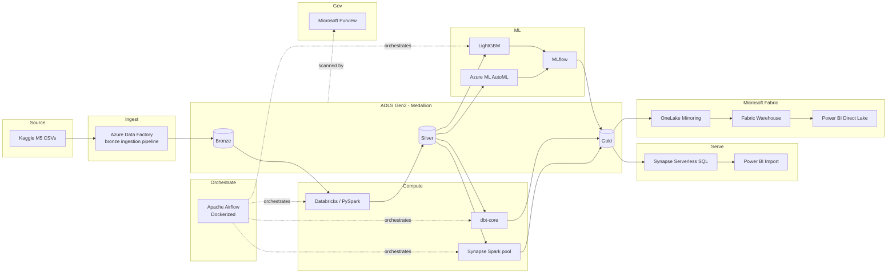

# M5 Demand Forecasting — Azure End-to-End Data Engineering Project

Hierarchical demand forecasting on Walmart's real M5 dataset (30,490 item-store series, 1,913+ days of daily sales), built as a full lakehouse pipeline across the classic Azure data stack plus a Microsoft Fabric serving layer.

Full design rationale, cost strategy, and decision log live in [`docs/project_spec.md`](docs/project_spec.md). This README covers what's in the repo and how to run it.

## Architecture

## What's in the repo

| Path | Contents |
|---|---|
| `infra/` | Terraform for every Azure resource: resource group, ADLS Gen2, ADF, Databricks workspace, Synapse workspace + Spark pool, Azure ML workspace, Key Vault, Purview account |
| `adf/` | Linked service, dataset, and pipeline JSON for bronze ingestion |
| `airflow/` | Dockerized Airflow, DAG orchestrating Databricks → Synapse Spark → dbt → training |
| `notebooks/` | Databricks PySpark: bronze → silver (reshape, join, feature engineering) |
| `synapse-spark/` | Synapse Spark notebook: silver → gold aggregation (separate engine, separate job) |
| `dbt/` | dbt-core project: gold star schema, tests, docs |
| `ml/` | AutoML config, LightGBM training with MLflow, WRMSSE evaluation |
| `powerbi/` | DAX measures and report notes for both serving paths |
| `fabric/` | OneLake Mirroring setup, Fabric Data Factory mapping notes |
| `.github/workflows/` | CI/CD: lint/test, Terraform plan/apply, dbt test |
| `docs/project_spec.md` | Full architecture spec and decision log |

## Dataset

[M5 Forecasting - Accuracy](https://www.kaggle.com/competitions/m5-forecasting-accuracy) (Walmart, via Kaggle). Download `sales_train_validation.csv`, `sell_prices.csv`, `calendar.csv`, and `sample_submission.csv`, and drop them somewhere ADF's bronze pipeline can reach (a storage account container, or upload directly — see `adf/README.md`).

## Running it

1. `cd infra && terraform init && terraform apply` — provisions everything (see `infra/README.md` for variables and cost notes).
2. Import `adf/pipelines/*.json` into the provisioned Data Factory, point the linked service at your storage account, run the bronze pipeline.
3. `cd airflow && docker compose up` — brings up the orchestration layer; trigger the `m5_pipeline` DAG.
4. Airflow runs: Databricks silver notebook → Synapse Spark gold job → `dbt run && dbt test` → LightGBM training (MLflow-logged).
5. Query the gold tables via Synapse serverless SQL, or open the Power BI files in `powerbi/`.
6. Optional: follow `fabric/onelake_mirroring.md` to mirror the gold Delta tables into Fabric and build the Direct Lake report.

## Cost

Built to run inside Azure's $200/30-day free trial credit plus Microsoft Fabric's separate 60-day F64 free trial. See `docs/project_spec.md` section 5 for the full breakdown and teardown checklist.

## License

MIT — see `LICENSE`.