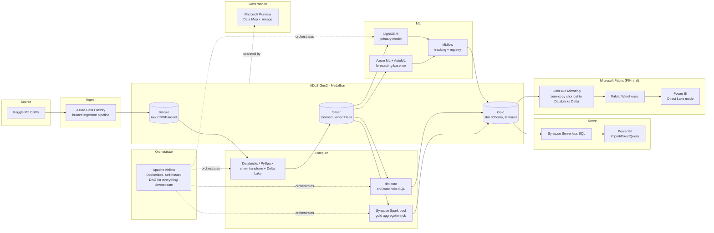

# Azure End-to-End Demand Forecasting — Project Spec

## 1. Problem and dataset

**Problem:** hierarchical demand forecasting — predict daily unit sales per item/store 28 days out.

**Dataset:** M5 Forecasting - Accuracy (Walmart), via Kaggle. Real production retail data, genuinely messy:

- `sales_train_validation.csv` — 1,913+ days of daily unit sales for ~30,490 item-store combinations (3 states, 10 stores, 3 categories, 7 departments). Heavy intermittency — most items sell zero units most days.
- `sell_prices.csv` — weekly prices per store/item. Prices change mid-series, some items missing prices for stretches (they weren't stocked).
- `calendar.csv` — dates mapped to weekday, month, year, and event flags (religious, cultural, sporting, national holidays) plus SNAP (food-assistance benefit) eligibility per state, which materially shifts purchasing.
- Total ~450MB raw, expands to several GB once melted from wide to long format and joined — enough to make single-machine pandas painful and justify Spark, but light enough to fit inside a $200 Azure trial without babysitting cost.

This is the same dataset behind the M5 competition, so there's a large body of public benchmarks to compare against, including the winning approaches (mostly LightGBM).

## 2. Architecture

Medallion lakehouse pattern on ADLS Gen2. ADF handles ingestion into bronze; a standalone Apache Airflow instance orchestrates everything downstream (Databricks, Synapse Spark, dbt, training jobs); Databricks does the heavy silver-layer transform while a Synapse Spark pool handles a separate gold-layer job; dbt models the star schema; Purview scans and tracks lineage across the lake; forecasting runs through Azure ML AutoML and MLflow-tracked LightGBM. The gold layer is served two ways: the classic path (Synapse serverless SQL + Power BI) and a Fabric path (OneLake Mirroring of the Databricks tables, zero-copy, into Fabric Warehouse + Power BI Direct Lake) — both are built so the project can speak to the classic stack and to Fabric.



## 3. Service breakdown

| Layer | Azure / tool | Role in this project | Skill it demonstrates |
|---|---|---|---|
| Ingestion | Azure Data Factory | Pulls raw CSVs into bronze, parameterized + scheduled | Pipeline orchestration, ADF (still in most Azure DE postings) |
| Orchestration | Apache Airflow (Dockerized, self-hosted) | DAG that runs Databricks → Synapse Spark → dbt → training jobs in order, with retries/SLAs | Airflow — see note below, this replaced ADF's Managed Airflow |
| Storage | ADLS Gen2 | Bronze/silver/gold zones, Delta format | Data lake design, partitioning, file formats |
| Transform (heavy) | Azure Databricks (PySpark) | Wide-to-long reshape, joins, lag/rolling features, intermittent-demand handling | Spark, distributed computing — top salary differentiator |
| Transform (secondary) | Synapse Spark pool | A distinct gold-layer aggregation job (e.g. store/category rollups for BI), kept separate from the Databricks job on purpose | Synapse Spark — shows you can articulate when to use which engine |
| Transform (modeling) | dbt-core | Silver → gold: star schema (`fct_sales`, `dim_item`, `dim_store`, `dim_calendar`, `dim_price`), tests, docs, lineage | dbt — high-demand, resume-visible via generated docs site |
| Data quality | dbt tests + Great Expectations | Null/range checks, referential integrity, freshness | Data quality / observability |
| Governance | Microsoft Purview | Scans ADLS Gen2 + Databricks + Synapse, builds the Data Map and lineage graph | Data governance — increasingly asked for at senior DE level |
| Forecasting baseline | Azure ML AutoML (forecasting task) | Quick benchmark model, no custom code | AutoML, Azure ML workspace |
| Forecasting primary | LightGBM (custom, in Databricks) | Real approach used by top M5 solutions | Gradient boosting, feature engineering |
| Experiment tracking | MLflow | Params/metrics/artifacts for every AutoML + LightGBM run, model registry | MLflow — asked for explicitly, also transferable outside Azure |
| Serving (SQL, path 1) | Synapse serverless SQL pool | Query gold Delta tables without a dedicated pool (keeps cost near zero) | Synapse, distributed SQL |
| BI (path 1) | Power BI (Import/DirectQuery) | Forecast-vs-actual, WRMSSE by category/store, price-elasticity views | Power BI, DAX |
| Fabric integration | OneLake Mirroring of Databricks gold tables + Fabric Warehouse | Zero-copy shortcut, no data duplication, near-real-time sync into Fabric | Microsoft Fabric, OneLake — the current Databricks/Fabric interoperability pattern |
| BI (path 2) | Power BI (Direct Lake mode, on Fabric) | Same report rebuilt against the mirrored Fabric data, for a genuine Direct Lake vs. Import comparison | Fabric Power BI, Direct Lake |
| IaC | Terraform | Provisions every resource above from code | IaC — most cross-cloud-portable choice; can port to Bicep later if you want the Azure-native variant too |
| CI/CD | GitHub Actions | Lints, runs dbt tests, applies Terraform, triggers ADF pipeline, deploys Airflow DAGs | CI/CD, GitOps |

## 4. Forecasting approach

1. **Baseline:** seasonal naive (last year, same weekday) — establishes the floor any real model must beat.
2. **AutoML:** Azure ML's forecasting AutoML run over the same feature set, logged to MLflow — gives a "did I actually add value over a managed tool" checkpoint.
3. **Primary model:** LightGBM with engineered features — lags (7/28/365-day), rolling means/std, price change flags, SNAP/event flags, day-of-week and month encodings. This mirrors the actual top-scoring M5 approaches.
4. **Metric:** WRMSSE (Weighted Root Mean Squared Scaled Error) — the actual M5 competition metric, not generic RMSE. Using the domain-correct metric is a detail recruiters/interviewers notice.
5. **Registry:** best model per retrain pushed to MLflow Model Registry, promoted stages (staging → production).

## 5. Cost strategy (free-tier only)

- Do the heavy build inside the $200 / 30-day Azure free trial credit — that covers ADF runs, ADLS storage, Databricks compute (small autoterminating clusters), Synapse Spark pool bursts, and Synapse serverless queries at this data volume with room to spare.
- Databricks: use small clusters (single-node, autotermination after 15–20 min idle) during the trial; fall back to Databricks Community Edition for notebook development when not actively burning trial credit (note: Community Edition can't be triggered externally, so it's dev-only, not part of the deployed pipeline).
- Synapse: serverless SQL pool for serving + a Spark pool that only spins up for the scheduled gold job, no dedicated SQL pool — dedicated pools are the main cost risk in this stack and add nothing this project needs.
- Airflow: self-hosted via Docker Compose for local dev; if you want it actually reachable in the cloud, Azure Container Apps has an always-free monthly allowance (180,000 vCPU-seconds, 360,000 GiB-seconds) that's enough to run a small Airflow scheduler + webserver continuously at this scale, so it shouldn't touch the $200 trial credit at all.
- Purview: the Data Map scan itself is free — you only get billed once you link scanned assets to governance concepts (data products, critical data elements, classifications beyond the automatic ones). Stick to scanning + lineage visualization for this project and skip the curated-governance features, and it should cost close to nothing.
- Fabric: separate free allowance entirely — the F64 trial capacity is free for 60 days, independent of the $200 Azure credit, with up to 1TB of OneLake storage. Do the Fabric/OneLake mirroring and Direct Lake work inside that window; when it lapses, workspace content stays in OneLake for 7 days, so export the Direct Lake .pbix and a few screenshots of the mirrored lineage before that grace period ends.
- After the trial windows: tear down compute (Databricks clusters, Synapse Spark pool), keep ADLS Gen2 storage (cheap), Airflow on its free Container Apps allowance, and the GitHub repo with Terraform so the whole thing is redeployable on demand for an interview or demo.
- Capture portfolio evidence while resources are live: MLflow experiment screenshots/exports, both Power BI .pbix files (Import and Direct Lake — both work offline once exported), ADF pipeline run history export, Purview lineage graph screenshot, OneLake mirroring config screenshot, dbt docs site (static HTML, can be hosted on GitHub Pages permanently for free).

**Note on Airflow:** ADF's built-in "Managed Airflow" (Workflow Orchestration Manager) stopped accepting new instances on January 1, 2026 — Microsoft is pushing that workload to Fabric instead. So that specific integration is a dead end right now. What you actually want for the Airflow skill is standalone Apache Airflow, which is also the better move for your resume: it's the version almost every job posting means when they say "Airflow" (Airflow shows up in roughly 29% of data engineering postings, ahead of dbt), and it's portable — the same DAGs work regardless of which cloud you're on, unlike a cloud-vendor-specific orchestration feature.

## 6. Fabric: included, as an addition rather than a replacement

I checked this properly before answering, because "Microsoft is moving there anyway" is a reasonable instinct but not the whole picture. What I found: Fabric is genuinely Microsoft's strategic direction, and Fabric-titled roles are growing fast — but the classic stack (ADF, Synapse, Databricks) is still running in thousands of live enterprise environments, and the actual expert consensus right now is "learn both," not "skip straight to Fabric." A resume that only shows Fabric reads as narrower than one that shows both, since most companies hiring today haven't migrated yet and want people who can either land where they are or lead the migration.

So rather than replacing ADF/Synapse/Databricks with Fabric equivalents, the project adds a genuine Fabric integration layer on top of what's already spec'd:

- **Mirror the Databricks gold Delta tables into Fabric via OneLake Mirroring** — a zero-copy, zero-ETL shortcut (no data duplication, near-real-time sync). This is the actual pattern Microsoft and Databricks are jointly promoting right now as the interoperability story between the two platforms, so building it is a very current, very specific thing to talk about in an interview.
- **Fabric Warehouse + Power BI in Direct Lake mode** as a second serving path, alongside the existing Synapse serverless SQL + Power BI Import path. This turns the project into a genuine comparison exercise — Direct Lake vs. Import/DirectQuery, latency, freshness, cost — which is a stronger story than just picking one.
- **Fabric Data Factory** gets a short writeup (not a full rebuild) showing that the same ADF pipeline maps almost 1:1 onto Fabric Data Factory, referencing Microsoft's own ADF-to-Fabric migration assistant (public preview this year). That's the "I know the migration path" line without doubling the ingestion build.
- Runs on **Fabric's own 60-day free trial capacity (F64, up to 1TB OneLake storage)** — a separate free allowance from the $200 Azure credit, so this genuinely doesn't cost anything extra or compete with the rest of the build's budget.

## 7. Repo structure (preview)

```
m5-azure-forecasting/
├── infra/                  # Terraform - all Azure resources
├── adf/                    # ADF pipeline/dataset/linked service JSON, exported
├── airflow/                 # Dockerfile, docker-compose.yml, dags/
├── notebooks/              # Databricks PySpark notebooks (bronze→silver, feature eng)
├── synapse-spark/           # Synapse Spark notebook(s) for gold aggregation
├── dbt/                    # dbt project (silver→gold models, tests, docs)
├── ml/
│   ├── automl/             # Azure ML AutoML job config + results
│   ├── lightgbm/            # training script, MLflow logging
│   └── evaluation/         # WRMSSE implementation, backtesting
├── powerbi/
│   ├── synapse-import/      # .pbix on Synapse serverless SQL (Import/DirectQuery)
│   └── fabric-direct-lake/ # .pbix on Fabric Warehouse (Direct Lake)
├── fabric/                  # OneLake mirroring config, Fabric Data Factory pipeline writeup
├── .github/workflows/      # CI/CD pipelines
└── README.md               # architecture diagram, setup, results
```

## 8. Phased build plan

1. IaC + resource provisioning (ADLS Gen2, ADF, Databricks, Synapse, Azure ML workspace, Purview account)
2. Bronze ingestion (ADF pipeline, raw CSVs landed)
3. Airflow stood up (Docker Compose locally, or Container Apps), first DAG wired to trigger a Databricks job
4. Silver transform (Databricks/PySpark — reshape, join, clean, Delta tables)
5. Purview scan configured against ADLS Gen2 + Databricks + Synapse, lineage visible in Data Map
6. Gold modeling: Synapse Spark aggregation job + dbt (star schema, tests, docs), both triggered from Airflow
7. Forecasting (AutoML baseline → LightGBM primary → MLflow tracking/registry), training job added to the Airflow DAG
8. Serving, path 1 (Synapse serverless views, Power BI Import/DirectQuery report)
9. Fabric layer: spin up F64 trial, mirror the Databricks gold tables into OneLake, build the Fabric Warehouse + Direct Lake Power BI report (serving path 2), write up the Fabric Data Factory mapping for the ingestion stage
10. CI/CD (GitHub Actions wiring it all together) + README/architecture writeup, including the Direct Lake vs. Import comparison notes

## 9. Decisions locked

- **IaC:** Terraform now, Bicep variant can follow later.
- **Orchestration:** standalone Apache Airflow (not ADF's Managed Airflow — that feature stopped taking new instances Jan 1, 2026). ADF still owns bronze ingestion; Airflow owns everything downstream.
- **Governance:** Microsoft Purview included from the start, scoped to scanning + lineage only to keep cost near zero.
- **Spark engines:** both Databricks (silver transform, native MLflow) and Synapse Spark pool (gold aggregation), deliberately split so the project can speak to when you'd reach for each.
- **Fabric:** included as an added serving/integration layer via OneLake Mirroring + Direct Lake Power BI, on top of the classic ADF/Synapse/Databricks build rather than replacing it, running on Fabric's separate free 60-day F64 trial.

## 10. Amendment (post-Stage 4): Spark compute consolidated onto Fabric

**Original plan:** Databricks (silver transform, native MLflow) + Synapse Spark pool (gold aggregation), run as two deliberately separate engines.

**What happened:** Azure Databricks cluster creation failed with a compute-quota error. Investigation via Azure Quotas (Portal -> Quotas -> Compute) showed the Azure for Students subscription is capped at a hard ceiling of ~4 vCPUs total, and this ceiling turned out to be **subscription-wide, not per-region** -- recreating the Databricks workspace in a second region (North Central US, after East US 2) produced identical quota numbers, confirming it. A self-service quota increase request was submitted and declined.

**Why this isn't just a Databricks problem:** Synapse Spark pools are also backed by Azure VMs drawing from the same compute quota family, so the original two-engine design was very likely to hit the identical wall at Stage 7, just later.

**Decision:** consolidate Spark transform work (both the silver-layer transform and the gold-layer aggregation) onto **Microsoft Fabric** notebooks against a Fabric Lakehouse, instead of Databricks clusters and a Synapse Spark pool. Fabric compute draws from Fabric Capacity Units, a completely separate allocation system from classic Azure Compute VM quota, which sidesteps this specific constraint rather than working around it.

**What this changes:**
- The Azure Databricks workspace stays in the project, fully and correctly configured (managed identity, RBAC role assignments, networking) -- it's real, demonstrable infrastructure work, just not used for actual compute due to the account-level quota ceiling. Documented here rather than quietly deleted.
- dbt's target moves from "dbt-core on Databricks SQL" to dbt against Fabric's SQL endpoint/Warehouse (`dbt-fabric` adapter).
- The Synapse Spark pool is dropped from the design; Synapse's role narrows to serverless SQL only, serving the classic-stack Power BI path.
- Fabric's role expands from "added at the end as a serving layer" (OneLake Mirroring + Direct Lake Power BI) to "core compute used throughout the transform and modeling stages," in addition to its original serving-layer role.
- Airflow orchestration is unaffected -- Fabric exposes a REST API, so the `transform_silver_databricks` and `aggregate_gold` DAG tasks get retargeted at Fabric instead of losing external triggering entirely (unlike the Databricks Community Edition alternative, which was considered and rejected specifically because it cannot be triggered externally).

This is a real infrastructure constraint, not a design do-over for its own sake -- worth stating plainly in any write-up of this project rather than glossed over.

## 11. Amendment (post-Stage 7): Fabric blocked too, Synapse blocked too, final v1 lands on local PySpark + Tableau

The Fabric pivot from section 10 didn't survive contact with reality either. Signing up for the F64 trial capacity failed with "only for school or work account" -- Fabric requires a Microsoft Entra account tagged as work/school, and a personal Gmail-based Azure subscription doesn't qualify, even though Azure itself had happily auto-created a guest tenant for it. That's a hard account-type gate, not a quota you can request an increase on.

At that point two separate cloud Spark options had failed for two unrelated reasons (Databricks: compute quota, Fabric: account type), so the transform work moved off Azure/Fabric compute entirely and ran locally: PySpark on my own machine, reading and writing directly against ADLS Gen2 over `abfss://`, authenticated with a storage key pulled from Key Vault at runtime via `DefaultAzureCredential`. Both the bronze-to-silver reshape (unpivot wide-to-long, join in calendar and prices) and the silver-to-gold aggregation ran this way, with row counts checked by hand at every step against the arithmetic they should produce (30,490 x 1,941 = 59,181,090, and so on), so a silent mistake couldn't slide through unnoticed.

Serving hit a third wall. Standing up a Synapse workspace for its serverless SQL pool (chosen specifically because serverless needs no provisioned compute, so it shouldn't have been able to hit a quota problem at all) failed at deployment with `SqlServerRegionDoesNotAllowProvisioning`. Tried it in two different regions, East US 2 and North Central US -- identical error both times, which points to a subscription-wide restriction on creating new Azure SQL Database servers rather than a regional capacity issue. Every Synapse workspace provisions one of these underneath, whether or not you ever touch a dedicated SQL pool. Azure for Students subscriptions appear to block this outright, most likely as a fraud-prevention measure. Dropped Synapse from v1 entirely rather than burn more time chasing a fourth region.

Power BI didn't make it either, for an unrelated reason: Power BI Desktop has no native Mac build, and running it through a Windows VM (Parallels or similar) meant paying for and setting up a second piece of software just to build one dashboard, which wasn't worth it against a live $10 budget that had already tripped its 50% alert. Tableau Public stood in instead: free, native on Mac, and it publishes to a shareable public link, which Power BI Desktop wouldn't have given for free anyway.

Net effect: the gold table gets exported to a local CSV and Tableau Public reads that file directly, rather than either product querying a live Azure endpoint. For a five-year-old, static Kaggle dataset this loses nothing real -- there's no live data to keep in sync with -- but it's worth being upfront that the serving layer in this project is file-based, not a live cloud query engine, and saying so plainly here rather than letting a diagram imply otherwise.

Three real infrastructure walls hit in a row on this subscription: Databricks compute quota, Fabric's account-type gate, Synapse's SQL server provisioning block. All three are documented rather than hidden, because working around a constraint you can name and explain is a better story than a build with no friction in it at all.

One open item: the Databricks workspace created in section 10 should be deleted if it hasn't been already, since it now has zero role in the final architecture and standing infrastructure was the leading suspect behind the budget alert. Confirm its state in the portal before treating this project as closed out.

## 12. Final v1 scope -- what's actually built, and what's next

This project shipped a real, working, but intentionally smaller slice than the original nine-service plan in sections 1 through 9. That plan was the honest starting ambition; this section is the honest final accounting. Nothing below was abandoned quietly -- each cut is explained in sections 10 and 11, and each is a genuine, resumable next step rather than a dead end.

Shipped in v1, all verified end to end:

- Terraform: resource group and provider configuration. The remaining resources (storage account, Key Vault) were created through the Azure Portal on purpose, to actually see and understand what each resource's console looks like before automating it -- a deliberate sequencing choice for learning, not a shortcut taken to skip Terraform.
- ADLS Gen2 with hierarchical namespace, three containers (bronze/silver/gold), Key Vault storing the storage key behind RBAC (not the older vault access policy model), with a managed identity role assignment for ADF set up correctly after an early false start.
- Azure Data Factory: git-integrated pipeline, parameterized dataset and ForEach+Copy activity, landing to bronze, debugged and published successfully.
- Apache Airflow: self-hosted via Docker Compose (CeleryExecutor, Redis, Postgres), a real DAG with genuine task dependencies, manually triggered and confirmed passing end to end. The downstream tasks (`transform_silver_databricks`, `aggregate_gold`, `train_model`) are currently placeholders, since the engines they were meant to call (Databricks, Fabric) didn't survive the subscription's constraints -- retargeting them at whatever compute replaces those is the natural next step, not a rewrite.
- Local PySpark transform: bronze to silver (reshape, join calendar and prices) and silver to gold (daily aggregation by store and category, with SNAP and event flags), both reading and writing straight to ADLS Gen2, both verified against hand-checked row counts.
- Tableau Public dashboard on the gold layer: a daily sales trend by category (showing real weekly seasonality and a sales collapse every single Christmas Day), a SNAP-effect comparison (FOODS shows the clear lift, HOBBIES doesn't move, consistent with SNAP's food-only eligibility rules), and a state-level map of total volume.
- GitHub Actions CI: lints the PySpark and DAG code and validates the Terraform configuration, with no cloud credentials stored anywhere in CI, since `terraform validate` checks configuration syntax only and never calls the Azure API.

Deferred past v1, each for a stated reason, each a real next step:

- dbt. The gold aggregation currently lives as plain PySpark rather than a dbt project. The medallion layers are already in place, so layering dbt models, tests, and generated docs on top of the existing silver/gold tables is a contained addition, not a redesign.
- Cloud Spark compute. Both Databricks and Fabric hit real, documented walls on this subscription tier (sections 10 and 11). Local PySpark covered v1; revisiting this with a paid subscription or a different compute budget is the obvious path back to a cloud engine.
- Synapse Serverless SQL. Blocked by the SQL server provisioning restriction described above. Worth retrying on a subscription without that restriction, since serverless SQL over a lake is a genuinely useful pattern this project didn't get to demonstrate.
- Microsoft Purview. Planned from the start (section 3), never built. Lineage and governance tooling is exactly the kind of thing that gets asked about at a senior level, so this is a good v2 addition once the pipeline it would scan is stable.
- The actual forecasting model. AutoML baseline, LightGBM with engineered lag/rolling features, MLflow tracking, WRMSSE evaluation -- none of this is built yet. Worth stating plainly: a project titled "demand forecasting" that stops at a clean gold table hasn't forecast anything yet. It's the explicit next phase, deliberately sequenced after the data engineering pipeline rather than attempted in parallel with it.
- Power BI. Skipped for a platform reason (no native Mac build), not a technical failure. Worth revisiting given access to a Windows machine, or exploring the Power BI Service's browser-based authoring instead.
